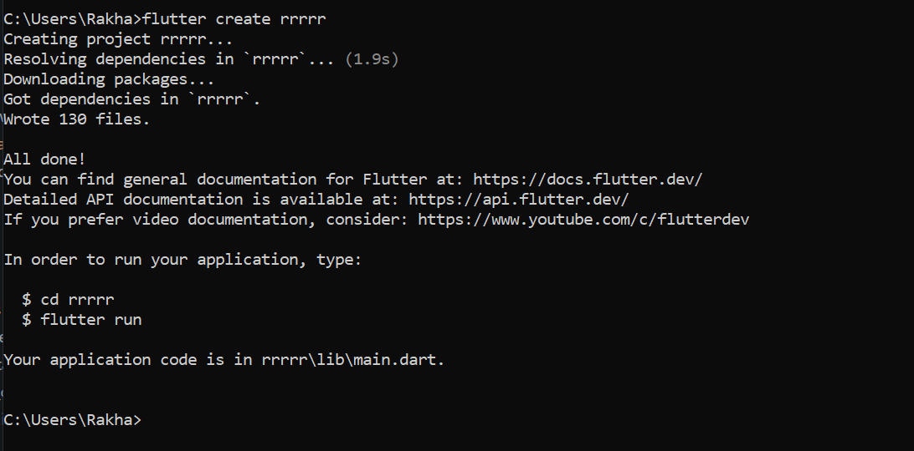
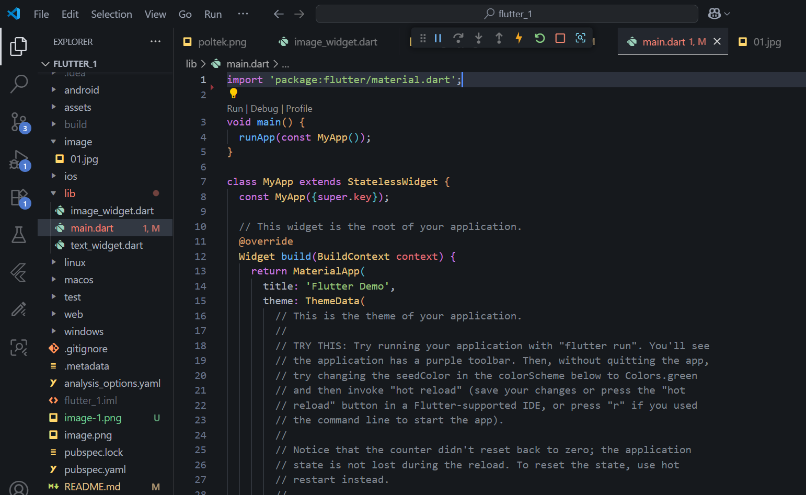
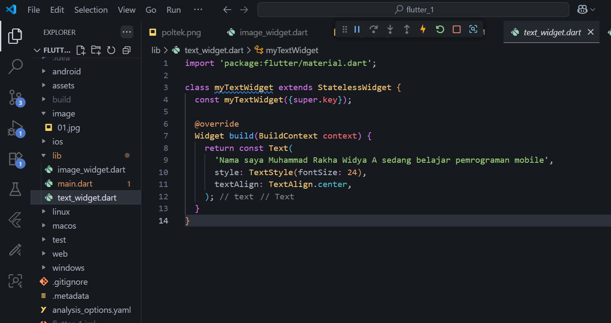
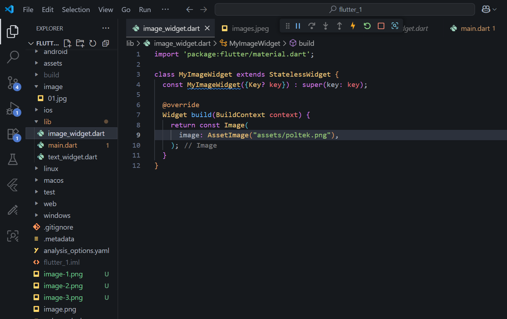
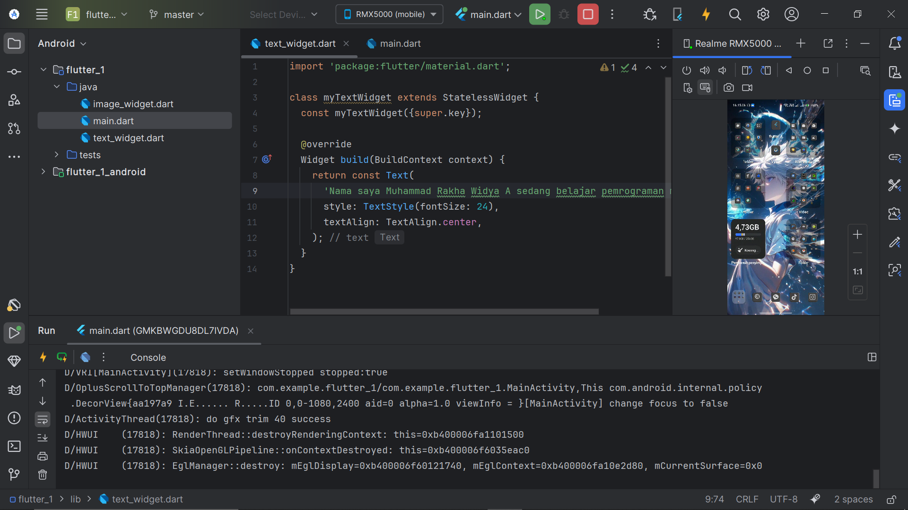
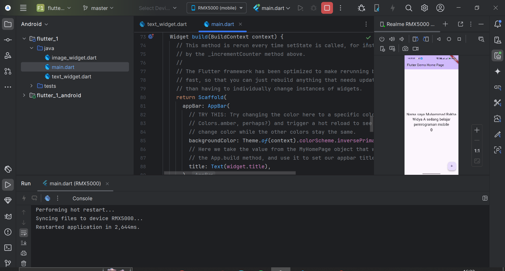
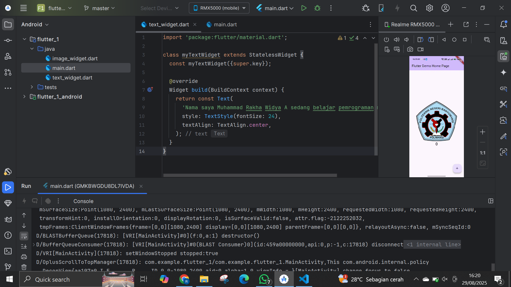

# hello_word

A new Flutter project.

pertama masuk ke file main.dart lalu ganti pada const menjadi file yang diinginkan(textwidget)

buat folder baru untuk project flutter, disini saya menggunakan cmd untuk membuat folder baru

pastikan tampilan awal untuk main jadi seperti ini

buat file baru untuk membuat mytext widget dengan nama myText_widget.dart lalu salin program tersebut, lalu lakukan import pada file main.dart agar dapat dijalankan

selanjutnya buat file imagewidget  dan masukkan gambar yang diinginkan dalam folder, import ke file main.dart

sebelumnya pastikan anda sudah menginstal flutter pada android studio, caranya dengan klik pencarian lalu ketik flutter, install

sambungkan android studio ke device android, jangan lupa untuk menginstal ndk sebelumnya dengan cara klik run

pada file main tadi buat agar mengimport file textwdiget agar dapat memunculkan text

setalah text widget tadi, ganti dengan mengimport ke image widget untuk memunculkan diandroid kita
